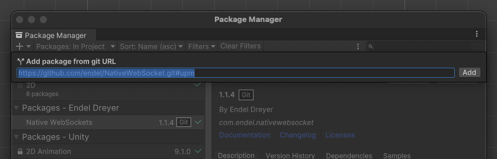

# How to use this example

<br>

## Unity packages preparation

1. Create a new Unity project
2. Replace the whole Asset folder in your Unity project folder
3. Open "Package Manager" (in [**Window**] tab)
4. Cick the "+" on the top-left corner, choose "Add package from Github URL"
5. Paste the URL below, and hit [**Enter**] or click [**Add**] on the right side
   ```text
   https://github.com/endel/NativeWebSocket.git#upm
   ```
   which would look like this:
   
6. Packages preparation done


## In Unity Scene:

1. Find the Canvas object from the component list on the left side (usually), and click it.
2. Open "Inspector" window if it's not open: <br>
   [**Window**] tab -> [**General**] -> Inspector
3. Click "Add Component" at the bottom of the Inspector window,<br> choose [**Scripts**] -> [**Send OOCSI Msg With J Object**]
4. In the [**Send OOCSI Msg With J Object**] block of the Inspector window, click the small circles on the right side of 
   components start with "**Button** ..." and double click the only component on the list
5. Repeat 4. for the "**Text** ..." component
6. Enter the channels for sending and receiving messages from OOCSI in the next two components
7. Scene preparation done, and which would look like this:


## In Data Foundry:

1. An active project 
2. An active IoT dataset, which is set to listen to the "Channel_to_send" of OOCSI channel you have in Unity.

3. A device in the same project, the ID ("device_id" in script) is required for Data Foundry to store data from OOCSI

4. Data Foundry preparation done

<br><br>

# Execute

Click the play icon in the center of up side

<br>

## Sending data

1. Just "Click me!!"
2. Check the incoming data of your IoT dataset on Data Foundry

## Receiving

1. Open the URL with browser: https://oocsi.id.tue.nl/test/visual
2. Enter the "Channel_to_receive" of OOCSI channel you have in Unity to the "Channel Name" on the right side. 

3. Click "Send"
4. Check your Unity, the text will be replaced by the incoming message